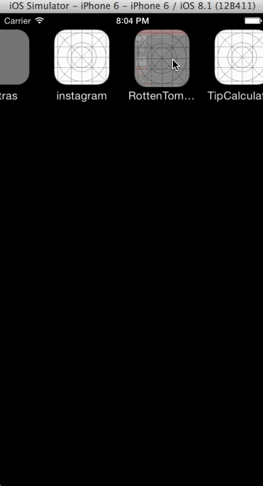

# RottenTomatoes
CodePath iOS Intro Class - Week 1 - Rotten Tomatoes

Build an app to view Rotten Tomatoes movie data (latest box office) with poster images, titles, and synopsis.

Time Spent: 3 hours

Completed user stories:
 * [x] Required: User can view a list of movies from Rotten Tomatoes. Poster images must be loading asynchronously.
 * [x] Required: User can view movie details by tapping on a cell.
 * [x] Required: User sees loading state while waiting for movies API. You can use one of the 3rd party libraries at http://cocoapods.wantedly.com?q=hud.
 * [ ] Required: User sees error message when there's a networking error. You may not use UIAlertView or a 3rd party library to display the error. See this screenshot for what the error message should look like: network error screenshot.
 * [x] Required: User can pull to refresh the movie list.
 * [ ] Optional: Add tab bar for Box Office and DVD.
 * [ ] Optional: Implement segmented control to switch between list view and grid view.
 * [ ] Optional: Add a search bar.
 * [ ] Optional: All images fade in.
 * [ ] Optional: For the large poster, load the low-res image first, switch to high-res when complete.
 * [ ] Optional: Customize the highlight and selection effect of the cell.
 * [ ] Optional: Customize the navigation bar.

Notes:

Walkthrough of all user stories:

GIF created with [LiceCap](http://www.cockos.com/licecap/).
